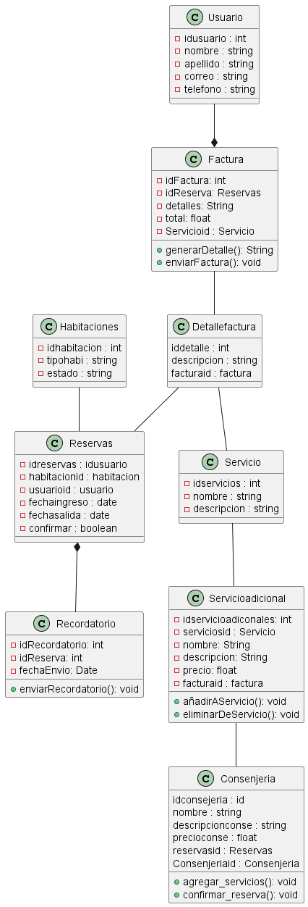
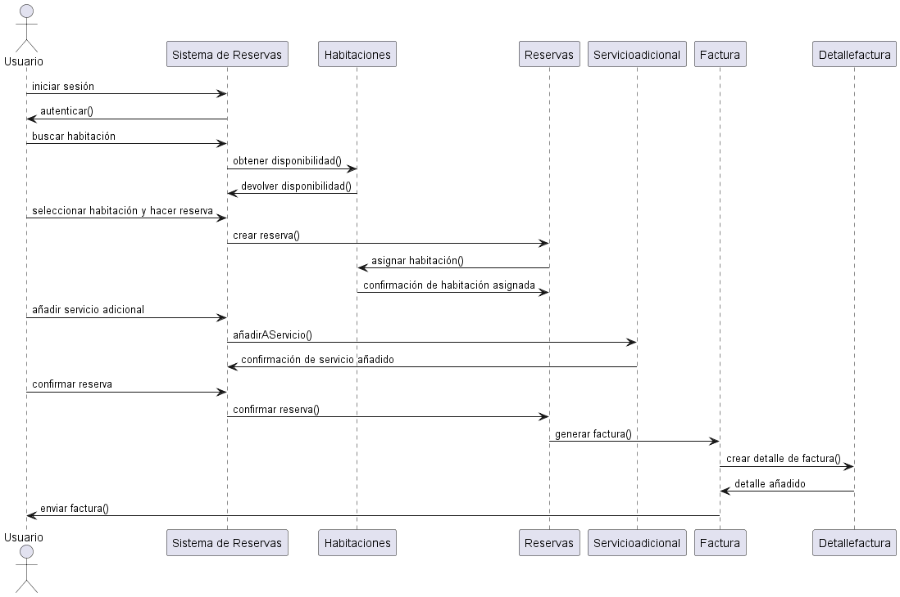
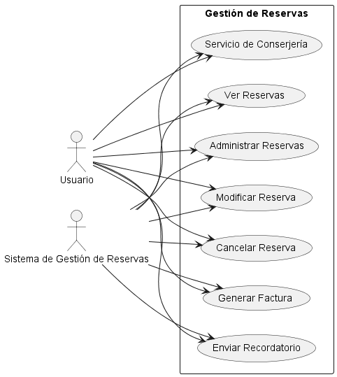

# taller_1



> Script de diagrama de clases
```sql
@startuml 
    
    class Usuario {
    - idusuario : int
    - nombre : string 
    - apellido : string
    - correo : string 
    - telefono : string
}

class Reservas {
    - idreservas : idusuario
    - habitacionid : habitacion
    - usuarioid : usuario
    - fechaingreso : date
    - fechasalida : date 
    - confirmar : boolean

}

class Habitaciones {
    - idhabitacion : int 
    - tipohabi : string
    - estado : string
}

class Servicioadicional {
  - idservicioadiconales: int
  - serviciosid : Servicio
  - nombre: String
  - descripcion: String
  - precio: float
  - facturaid : factura
  + añadirAServicio(): void
  + eliminarDeServicio(): void
}

class Factura {
  - idFactura: int
  - idReserva: Reservas
  - detalles: String
  - total: float
  - Servicioid : Servicio
  + generarDetalle(): String
  + enviarFactura(): void
}

class Detallefactura {
    iddetalle : int 
    descripcion : string 
    facturaid : factura
}

class Recordatorio {
  - idRecordatorio: int
  - idReserva: int
  - fechaEnvio: Date
  + enviarRecordatorio(): void
}

class Consenjeria {
    idconsejeria : id
    nombre : string
    descripcionconse : string
    precioconse : float
    reservasid : Reservas
    Consenjeriaid : Consenjeria
    + agregar_servicios(): void
    + confirmar_reserva(): void
}

class Servicio {
    - idservicios : int
    - nombre : string 
    - descripcion : string
}

Usuario  --*  Factura 
Detallefactura -- Servicio
Factura -- Detallefactura
Detallefactura -- Reservas
Habitaciones  -- Reservas  
Servicio -- Servicioadicional
Reservas  *--  Recordatorio 
Servicioadicional -- Consenjeria

@enduml

```




> Script de diagrama de secuencia
```sql
@startuml 

actor Usuario
participant "Sistema de Reservas" as SR
participant Habitaciones
participant Reservas
participant Servicioadicional
participant Factura
participant Detallefactura

Usuario -> SR: iniciar sesión
SR -> Usuario: autenticar()

Usuario -> SR: buscar habitación
SR -> Habitaciones: obtener disponibilidad()
Habitaciones -> SR: devolver disponibilidad()

Usuario -> SR: seleccionar habitación y hacer reserva
SR -> Reservas: crear reserva()
Reservas -> Habitaciones: asignar habitación()
Habitaciones -> Reservas: confirmación de habitación asignada

Usuario -> SR: añadir servicio adicional
SR -> Servicioadicional: añadirAServicio()
Servicioadicional -> SR: confirmación de servicio añadido

Usuario -> SR: confirmar reserva
SR -> Reservas: confirmar reserva()
Reservas -> Factura: generar factura()

Factura -> Detallefactura: crear detalle de factura()
Detallefactura -> Factura: detalle añadido
Factura -> Usuario: enviar factura()

@enduml

```





> Script de diagrama de usos
```sql

@startuml
left to right direction
actor Usuario as User
actor "Sistema de Gestión de Reservas" as System

rectangle "Gestión de Reservas" {
    usecase "Ver Reservas" as VerReservas
    usecase "Administrar Reservas" as AdminReservas
    usecase "Modificar Reserva" as ModificarReserva
    usecase "Cancelar Reserva" as CancelarReserva
    usecase "Generar Factura" as GenerarFactura
    usecase "Enviar Recordatorio" as EnviarRecordatorio
    usecase "Servicio de Conserjería" as ServicioConserjeria
}

User --> VerReservas
User --> AdminReservas
User --> ModificarReserva
User --> CancelarReserva
User --> GenerarFactura
User --> EnviarRecordatorio
User --> ServicioConserjeria

System --> VerReservas
System --> AdminReservas
System --> ModificarReserva
System --> CancelarReserva
System --> GenerarFactura
System --> EnviarRecordatorio
System --> ServicioConserjeria

@enduml


```
